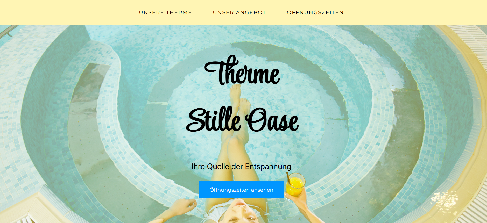

# **Therme Stille Oase Website**

Die Website der fiktiven Therme „Stille Oase“ ist mehrseitig. Die Hauptseite bietet einen Überblick über die Therme. Hierfür habe ich eine intuitive One-Page-Navigation mit sanftem Scrollverhalten eingebaut. Details zum Angebot, Impressum und Datenschutz sind auf separaten Seiten aufgelistet. Das Design ist responsiv, nutzt CSS-Grid- und Flexbox-Layouts für verschiedene Displaygrößen und wurde mit reinem HTML und CSS umgesetzt.

## Voraussetzungen
Für den Betrieb dieses Projekts sind keine Laufzeitumgebungen, Datenbanken oder Serverkonfigurationen erforderlich. Zum Betrachten und Bearbeiten werden lediglich benötigt:
- Ein aktueller Webbrowser.
- Ein Texteditor oder eine IDE (z. B. Visual Studio Code), falls der Quellcode editiert werden soll.

## Technologien
- HTML5: Semantische Gliederung des Inhalts unter Verwendung von Elementen wie nav, main, section, header und footer.
- CSS3: Umfassender Einsatz von Custom Properties (CSS-Variablen) zur zentralen Farbsteuerung, CSS Flexbox und CSS Grid für die Positionierung.
- Google Fonts: Externe Einbindung der Schriftfamilien Montserrat (Fließtext), Inter (Untertitel) und Style Script (Hauptüberschriften).

## Installation
Da es sich um eine statische Webanwendung handelt, entfällt ein Build-Prozess oder eine Paketinstallation. 

Das Projekt kann über Git lokal auf den eigenen Rechner kopiert werden:
```bash
git clone https://github.com
```

## Nutzung
1. Navigieren Sie in das Hauptverzeichnis des geklonten Projekts.
2. Öffnen Sie die Datei index.html per Doppelklick in Ihrem Webbrowser, um auf die Startseite zu gelangen.
3. Über die zentrale Navigationsleiste kann zwischen der Startseite und der Angebotsseite (angebot.html) gewechselt werden.
4. Integrierte Ankerlinks ermöglichen ein flüssiges Scrollen (Smooth Scrolling) zu spezifischen Abschnitten wie den Öffnungszeiten oder dem Kontaktbereich.

## Deployment
Die Website ist für das Hosting über GitHub Pages optimiert. Das Deployment erfolgt über folgende Schritte:
1. Navigieren Sie in den Einstellungen (Settings) des GitHub-Repositories zum Menüpunkt Pages.
2. Wählen Sie unter Build and deployment den gewünschten Quell-Branch (main oder master) aus.
3. Nach dem Speichern generiert GitHub automatisch eine öffentlich erreichbare URL unter dem Schema: https://github.io


## Lizenz
Das Projekt wurde von Xenia Wilczek entwickelt. Alle Rechte am Quellcode sowie an der gestalterischen Umsetzung sind vorbehalten (All Rights Reserved). Die rechtlichen Texte im Impressum und in der Datenschutzerklärung wurden zu Demonstrationszwecken über e-Recht24 generiert.
